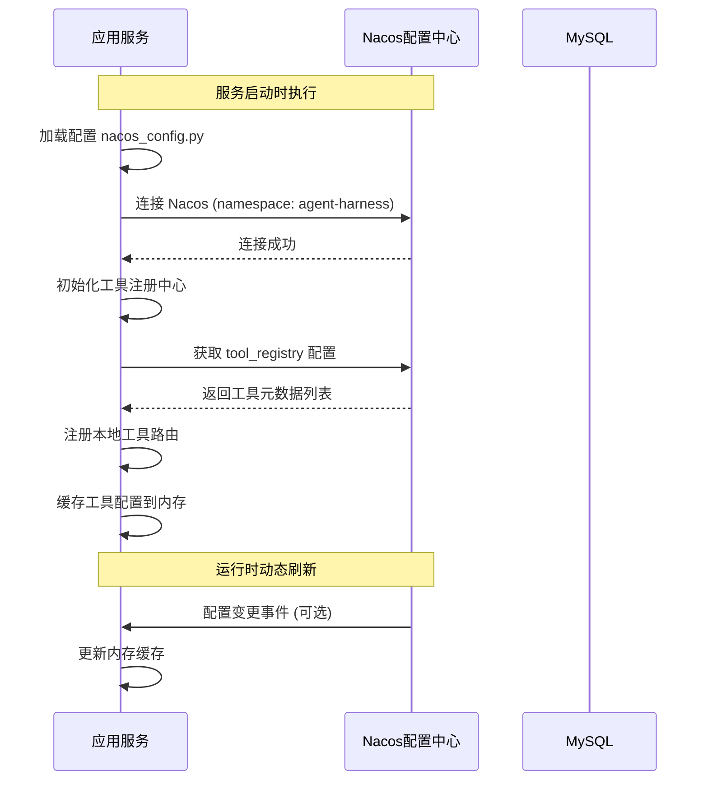
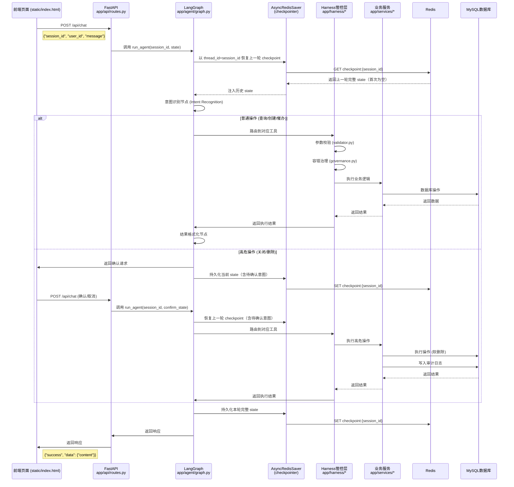
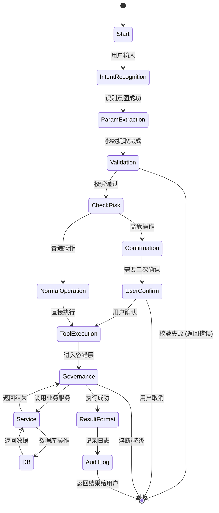

# 企业级 Harness 架构 AI 工单 Agent

基于 **LangGraph + Harness 六层架构** 的企业级工单智能助手，支持工单的查询、创建、催办、关闭、删除等操作，并实现完整的安全管控和容错治理。

---

## 技术栈

| 分类 | 技术 | 版本 | 说明 |
|------|------|------|------|
| Web 框架 | FastAPI | 0.115+ | 高性能异步 Web 框架 |
| Agent 编排 | LangChain + LangGraph | 0.2+ | 大语言模型编排与状态机 |
| 会话持久化 | langgraph-checkpoint-redis | 0.0.1+ | LangGraph 官方 Redis checkpointer，多轮会话自动持久化 |
| 配置中心 | Nacos | 2.3+ | 工具注册中心、配置管理 |
| 数据库 | MySQL | 8.0+ | 业务数据存储 |
| ORM | SQLAlchemy | 2.0+ | 异步数据库访问 |
| 缓存 | Redis | 7.0+ | 会话 checkpoint 存储、限流、缓存 |
| 参数校验 | Pydantic | 2.10+ | 强类型数据校验 |
| 容错组件 | tenacity + pybreaker | - | 分级重试、熔断器 |
| 运行环境 | Python | 3.10+ | 编程语言 |

---

## 架构设计

### 模块职责说明

| 模块 | 职责 | 类比 Spring |
|------|------|------------|
| `app/api/` | REST API 入口，接收和响应请求 | `@Controller` |
| `app/agent/` | LangGraph 状态机，意图识别、流程编排 | 业务编排层 |
| `app/harness/` | 统一管控：校验、路由、注册中心、容错 | `@Gateway` + 中间件 |
| `app/services/` | 业务逻辑实现 | `@Service` |
| `app/database/` | ORM 数据访问 + Redis 客户端单例 | `@Repository` / `@Entity` |
| `app/config/` | 外部配置加载 | `@Configuration` |

---

## 会话持久化机制

本项目使用 **LangGraph 官方 `AsyncRedisSaver` checkpointer** 管理多轮会话历史，取代手动 load/save 模式。

### 工作原理

```
旧方式：routes.py 手动 lrange → 塞入 state → 跑 graph → 手动 rpush
新方式：graph.compile(checkpointer=AsyncRedisSaver) → 传 thread_id → graph 自动恢复/持久化
```

- **`thread_id`** 使用 `session_id`，每个会话独立隔离
- **启动时** `asetup()` 在 Redis 中创建所需索引结构
- **每次调用前** checkpointer 自动从 Redis 恢复上一轮完整 state
- **每次调用后** checkpointer 自动将新 state 写回 Redis
- Redis 客户端通过 `app/database/redis_client.py` 单例复用，避免重复建连

### 对比旧方式

| 维度 | 旧方式（手动） | 新方式（checkpointer） |
|------|--------------|----------------------|
| 历史存储 | 手动 `rpush` | checkpointer 自动管理 |
| 历史读取 | 手动 `lrange` 后塞 state | `thread_id` 自动恢复 |
| 连接管理 | 每次请求新建连接 | 单例异步连接复用 |
| 中间状态 | 丢失 | checkpoint 完整保存 |
| TTL 管理 | 手动 `expire` | checkpointer 内置 |
| 代码复杂度 | routes.py 臃肿 | routes.py 只管 HTTP 层 |

---

## 调用链路详解

### 1. 工具注册到 Nacos 的流程



**Nacos 配置结构**：
- **Namespace**: `agent-harness`
- **Group**: `DEFAULT_GROUP`
- **Data ID**: `tool_registry.json`
- **配置内容示例**:
```json
{
  "workorder_query": {
    "tool_id": "workorder_query",
    "name": "查询工单",
    "description": "根据工单编号或创建人查询工单信息",
    "params": ["workorder_id", "creator"],
    "risk_level": "normal",
    "enabled": true
  }
}
```

---

### 2. 前端请求完整调用链路



---

### 3. 核心流程状态机图



---

## 核心功能

| 功能 | 类型 | 说明 |
|------|------|------|
| 查询工单 | 普通操作 | 根据工单编号或创建人查询 |
| 新建工单 | 普通操作 | 创建新工单，自动生成编号 |
| 工单催办 | 普通操作 | 催办未处理的工单 |
| 关闭工单 | 高危操作 | 需二次确认，审计日志记录 |
| 删除工单 | 高危操作 | 软删除，需二次确认，审计日志记录 |

---

## 快速开始

### 1. 启动基础设施

```bash
# MySQL
docker run -d --name mysql8 -p 3306:3306 \
  -e MYSQL_ROOT_PASSWORD=root123 -e MYSQL_DATABASE=agent_workorder \
  mysql:8.0 --character-set-server=utf8mb4

# Redis
docker run -d --name redis -p 6379:6379 redis:7-alpine

# Nacos
docker run -d --name nacos -e MODE=standalone -p 8848:8848 nacos/nacos-server:v2.3.2
```

### 2. 安装依赖

```bash
pip install -r requirements.txt
# 或使用 uv
uv pip install -r requirements.txt
```

### 3. 配置环境变量

复制 `.env.example` 为 `.env`，并根据实际环境修改配置：

```bash
cp .env.example .env
```

主要配置项说明：

| 配置项 | 默认值 | 说明 |
|--------|--------|------|
| `SERVER_PORT` | 8000 | 服务端口号 |
| `REDIS_HOST` | 127.0.0.1 | Redis 地址 |
| `REDIS_PORT` | 6379 | Redis 端口 |
| `LLM_API_KEY` | - | 阿里云 DashScope API Key |
| `LLM_MODEL` | qwen-plus | LLM 模型名称 |

### 4. 启动服务

```bash
python main.py
```

启动成功后会看到：
```
[Startup] 数据库初始化完成
[Startup] Nacos 工具配置加载完成
[Startup] 工具注册中心初始化完成
[Startup] 工具路由注册完成
[Startup] 正在初始化 LangGraph checkpointer...
[Startup] LangGraph checkpointer 初始化完成
[Startup] 服务启动完成，端口: 8000
```

### 5. 访问前端

打开浏览器访问：`http://localhost:${SERVER_PORT}/static/index.html`

**提示**：端口号由 `.env` 文件中的 `SERVER_PORT` 配置决定，默认值为 8000。

### 6. 接口调用

```bash
# 健康检查（端口根据 .env 配置的 SERVER_PORT 调整，默认为 8000）
curl http://localhost:8000/health

# 对话接口（同一 session_id 多轮调用，历史自动维护）
curl -X POST http://localhost:8000/api/chat \
  -H "Content-Type: application/json" \
  -d '{"session_id": "test-001", "user_id": "user001", "message": "查询我的工单"}'
```

> **注意**：以上示例使用默认端口 8000，实际调用时请根据 `.env` 文件中配置的 `SERVER_PORT` 值调整。

---

## 安全特性

- **高危操作二次确认**：关闭/删除工单需用户确认
- **操作限流**：同一账号 1 分钟内禁止重复高危操作
- **软删除**：删除操作仅标记，数据可恢复
- **审计日志**：所有高危操作强制落库记录
- **熔断降级**：服务异常时自动降级，返回友好提示

---

## 项目结构

```
workorder_harness_agent/
├── app/
│   ├── agent/           # LangGraph 状态机
│   │   ├── graph.py     # 状态机流程定义（含 checkpointer 注入）
│   │   ├── nodes.py     # 流程节点实现
│   │   └── state.py     # 状态定义（不含 chat_history）
│   ├── api/             # REST API 层
│   │   └── routes.py    # 接口路由（无手动 load/save history）
│   ├── config/          # 配置管理
│   │   └── nacos_config.py
│   ├── database/        # 数据访问层
│   │   ├── models.py    # ORM 模型
│   │   ├── session.py   # 数据库会话
│   │   ├── init_data.py # 初始化数据
│   │   └── redis_client.py  # Redis 异步客户端单例（供 checkpointer 使用）
│   ├── harness/         # Harness 管控层
│   │   ├── validator.py # 输入校验
│   │   ├── router.py    # 工具路由
│   │   ├── registry.py  # 工具注册中心
│   │   ├── governance.py# 容错治理
│   │   └── executor.py  # 执行代理
│   ├── services/        # 业务服务层
│   │   ├── workorder_service.py
│   │   └── audit_service.py
│   ├── common/          # 公共模块
│   └── schemas/         # 数据模型
├── prompt/              # Prompt 模板
├── static/              # 静态资源 (前端页面)
├── tests/               # 测试用例
├── .env                 # 环境变量
├── main.py              # 启动入口（含 checkpointer setup）
├── requirements.txt     # 依赖列表
└── README.md            # 项目文档
```
