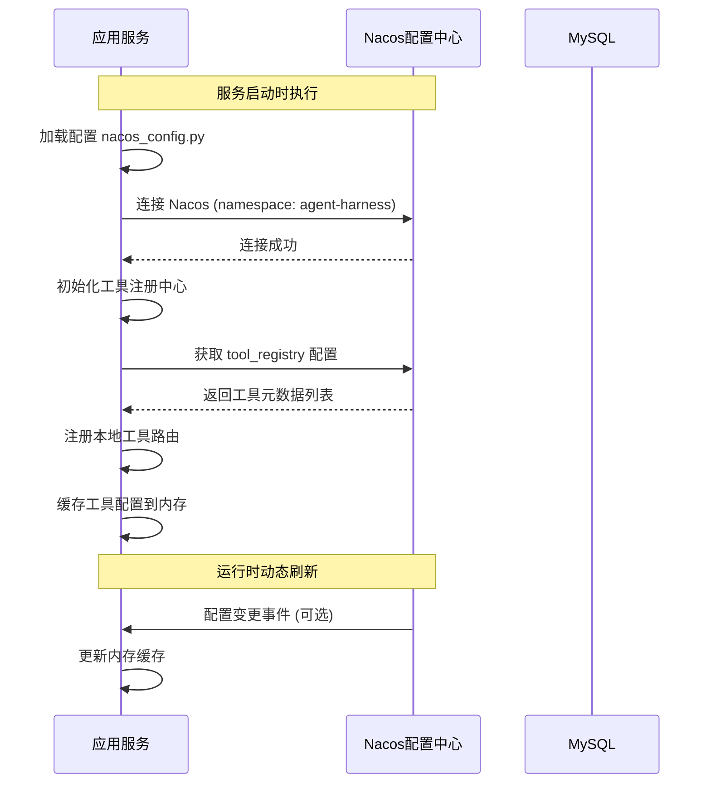
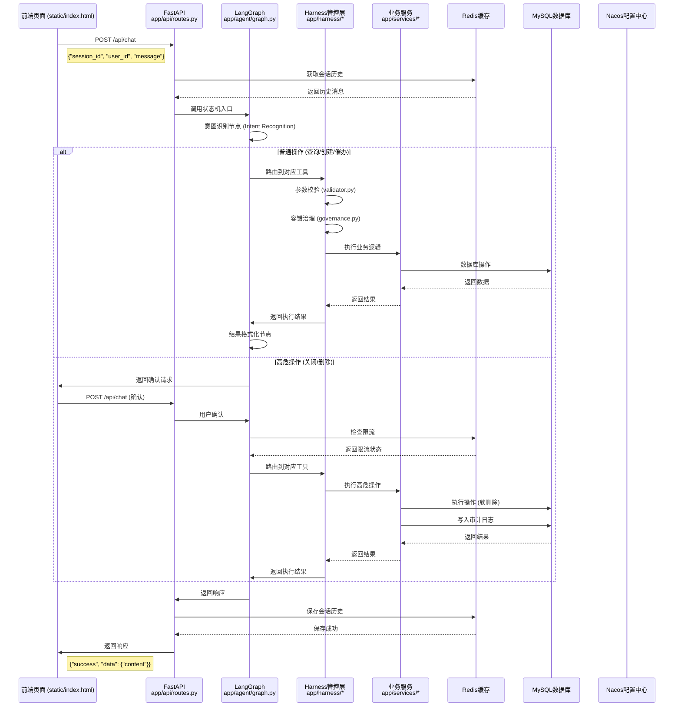
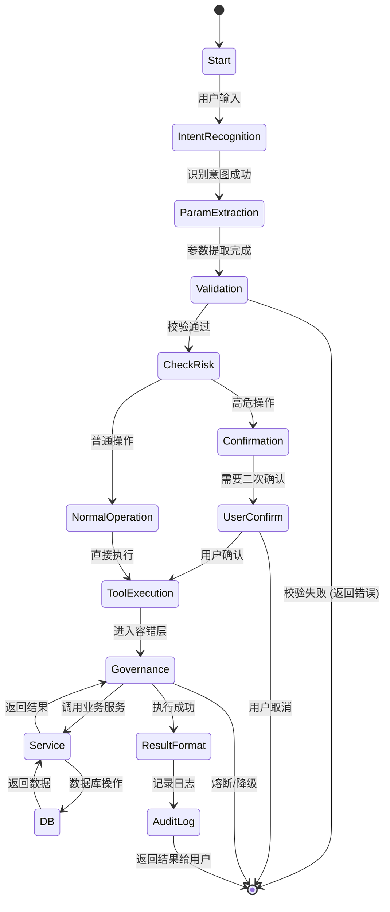

# 企业级 Harness 架构 AI 工单 Agent

基于 **LangGraph + Harness 六层架构** 的企业级工单智能助手，支持工单的查询、创建、催办、关闭、删除等操作，并实现完整的安全管控和容错治理。

---

## 技术栈

| 分类 | 技术 | 版本 | 说明 |
|------|------|------|------|
| Web 框架 | FastAPI | 0.111+ | 高性能异步 Web 框架 |
| Agent 编排 | LangChain + LangGraph | 0.2+ | 大语言模型编排与状态机 |
| 配置中心 | Nacos | 2.3+ | 工具注册中心、配置管理 |
| 数据库 | MySQL | 8.0+ | 业务数据存储 |
| ORM | SQLAlchemy | 2.0+ | 异步数据库访问 |
| 缓存 | Redis | 7.0+ | 会话记忆、限流、缓存 |
| 参数校验 | Pydantic | 2.10+ | 强类型数据校验 |
| 容错组件 | tenacity + pybreaker | - | 分级重试、熔断器 |
| 运行环境 | Python | 3.10+ | 编程语言 |

---

## 架构设计

### 模块职责说明

| 模块 | 职责 | 类比 Spring |
|------|------|------------|
| `app/api/` | REST API 入口，接收和响应请求 | `@Controller` |
| `app/agent/` | LangGraph 状态机，意图识别、流程编排 | 业务编排层 |
| `app/harness/` | 统一管控：校验、路由、注册中心、容错 | `@Gateway` + 中间件 |
| `app/services/` | 业务逻辑实现 | `@Service` |
| `app/database/` | ORM 数据访问 | `@Repository` / `@Entity` |
| `app/config/` | 外部配置加载 | `@Configuration` |

---

## 调用链路详解

### 1. 工具注册到 Nacos 的流程



**Nacos 配置结构**：
- **Namespace**: `agent-harness`
- **Group**: `DEFAULT_GROUP`
- **Data ID**: `tool_registry.json`
- **配置内容示例**:
```json
{
  "workorder_query": {
    "tool_id": "workorder_query",
    "name": "查询工单",
    "description": "根据工单编号或创建人查询工单信息",
    "params": ["workorder_id", "creator"],
    "risk_level": "normal",
    "enabled": true
  }
}
```

---

### 2. 前端请求完整调用链路



---

### 3. 核心流程状态机图



---

## 核心功能

| 功能 | 类型 | 说明 |
|------|------|------|
| 查询工单 | 普通操作 | 根据工单编号或创建人查询 |
| 新建工单 | 普通操作 | 创建新工单，自动生成编号 |
| 工单催办 | 普通操作 | 催办未处理的工单 |
| 关闭工单 | 高危操作 | 需二次确认，审计日志记录 |
| 删除工单 | 高危操作 | 软删除，需二次确认，审计日志记录 |

---

## 快速开始

### 1. 启动基础设施

```bash
# MySQL (已配置)
# Redis (使用现有 dify-redis)

# Nacos
docker run -d --name nacos -e MODE=standalone -p 8848:8848 nacos/nacos-server:v2.3.2
```

### 2. 安装依赖

```bash
pip3 install -r requirements.txt
```

### 3. 配置环境变量

编辑 `.env` 文件，配置数据库、缓存、Nacos 连接信息。

### 4. 启动服务

```bash
python3 main.py
```

### 5. 访问前端

打开浏览器访问：`http://localhost:8000/static/index.html`

### 6. 接口调用

```bash
# 健康检查
curl http://localhost:8000/health

# 对话接口
curl -X POST http://localhost:8000/api/chat \
  -H "Content-Type: application/json" \
  -d '{"session_id": "test-001", "user_id": "user001", "message": "查询我的工单"}'
```

---

## 安全特性

- **高危操作二次确认**：关闭/删除工单需用户确认
- **操作限流**：同一账号 1 分钟内禁止重复高危操作
- **软删除**：删除操作仅标记，数据可恢复
- **审计日志**：所有高危操作强制落库记录
- **熔断降级**：服务异常时自动降级，返回友好提示

---

## 项目结构

```
workorder_harness_agent/
├── app/
│   ├── agent/           # LangGraph 状态机
│   │   ├── graph.py     # 状态机流程定义
│   │   ├── nodes.py     # 流程节点实现
│   │   └── state.py     # 状态定义
│   ├── api/             # REST API 层
│   │   └── routes.py    # 接口路由
│   ├── config/          # 配置管理
│   │   └── nacos_config.py
│   ├── database/        # 数据访问层
│   │   ├── models.py    # ORM 模型
│   │   ├── session.py   # 数据库会话
│   │   └── init_data.py # 初始化数据
│   ├── harness/         # Harness 管控层
│   │   ├── validator.py # 输入校验
│   │   ├── router.py    # 工具路由
│   │   ├── registry.py  # 工具注册中心
│   │   ├── governance.py# 容错治理
│   │   └── executor.py  # 执行代理
│   ├── services/        # 业务服务层
│   │   ├── workorder_service.py
│   │   └── audit_service.py
│   ├── common/          # 公共模块
│   └── schemas/         # 数据模型
├── prompt/              # Prompt 模板
├── static/              # 静态资源 (前端页面)
├── tests/               # 测试用例
├── .env                 # 环境变量
├── main.py              # 启动入口
├── requirements.txt     # 依赖列表
└── README.md            # 项目文档
```