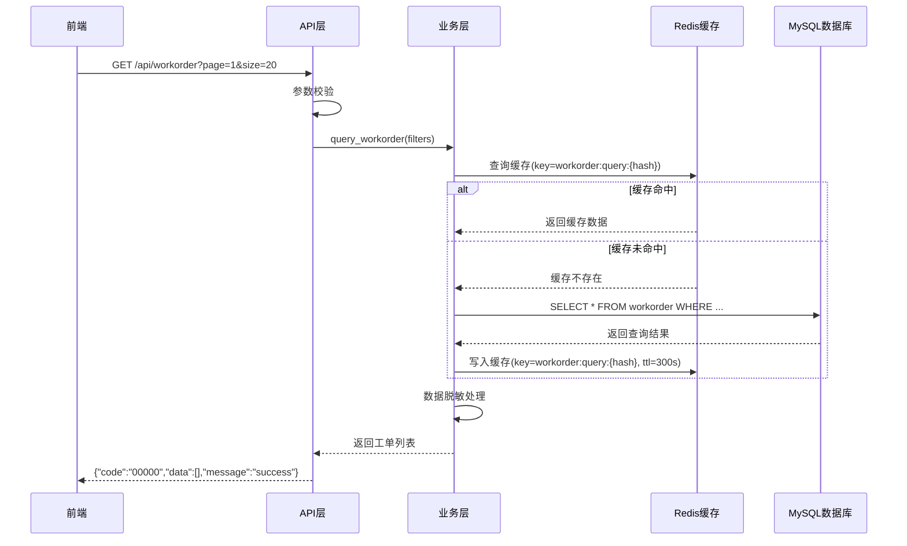

# 工单查询功能技术设计文档

---

## 一、需求分析

### 1.1 功能需求

| 需求点 | 描述 | 来源 |
|--------|------|------|
| 工单编号查询 | 支持单个或多个编号精确查询，逗号分隔 | PRD 2.1 |
| 创建人查询 | 支持前缀模糊匹配 | PRD 2.1 |
| 创建时间查询 | 支持日期范围查询，默认近7天 | PRD 2.1 |
| 分页展示 | 每页20条，支持页码跳转 | PRD 2.2 |
| 数据脱敏 | 创建人字段脱敏显示 | PRD 2.3, 4.2 |
| 详情弹窗 | 点击工单查看完整信息 | PRD 2.4 |

### 1.2 数据返回字段

| 字段名 | 类型 | 说明 | 脱敏 |
|--------|------|------|------|
| workorder_no | string | 工单编号 | 否 |
| title | string | 工单标题 | 否 |
| status | string | 工单状态 | 否 |
| creator | string | 创建人（脱敏） | 是 |
| created_at | datetime | 创建时间 | 否 |
| updated_at | datetime | 更新时间 | 否 |

---

## 二、技术选型

### 2.1 技术栈

| 分类 | 技术 | 版本 | 说明 |
|------|------|------|------|
| 语言 | Python | 3.11+ | 后端开发语言 |
| 框架 | FastAPI | 0.104+ | Web 框架 |
| ORM | SQLAlchemy | 2.0+ | 数据库操作 |
| 数据库 | MySQL | 8.0+ | 数据存储 |
| 缓存 | Redis | 7.0+ | 缓存查询结果 |

### 2.2 关键设计原则

- **分层架构**：Controller → Service → Repository → Database
- **单一职责**：每个类/方法只负责一个功能
- **依赖注入**：使用依赖注入管理服务
- **异常处理**：统一异常捕获和处理
- **日志记录**：关键操作记录日志

---

## 三、架构设计

### 3.1 模块划分

| 模块 | 职责 | 文件路径 |
|------|------|----------|
| api | REST API 入口 | `app/api/routes.py` |
| services | 业务逻辑层 | `app/services/workorder_service.py` |
| database | 数据访问层 | `app/database/repositories/workorder_repository.py` |
| schemas | 数据模型 | `app/schemas/workorder.py` |
| config | 配置管理 | `app/config/settings.py` |

### 3.2 核心流程图



---

## 四、数据库设计

### 4.1 表结构

**表名**: `workorder`

| 字段名 | 类型 | 约束 | 说明 |
|--------|------|------|------|
| id | BIGINT | PRIMARY KEY, AUTO_INCREMENT | 主键ID |
| workorder_no | VARCHAR(32) | UNIQUE, NOT NULL | 工单编号 |
| title | VARCHAR(255) | NOT NULL | 工单标题 |
| status | VARCHAR(32) | NOT NULL | 工单状态 |
| creator | VARCHAR(64) | NOT NULL | 创建人 |
| description | TEXT | NULL | 工单描述 |
| created_at | DATETIME | NOT NULL, DEFAULT CURRENT_TIMESTAMP | 创建时间 |
| updated_at | DATETIME | NOT NULL, DEFAULT CURRENT_TIMESTAMP ON UPDATE CURRENT_TIMESTAMP | 更新时间 |

### 4.2 索引设计

| 索引名 | 字段 | 类型 | 说明 |
|--------|------|------|------|
| idx_workorder_no | workorder_no | UNIQUE | 工单编号唯一索引 |
| idx_creator | creator | NORMAL | 创建人索引 |
| idx_created_at | created_at | NORMAL | 创建时间索引 |
| idx_status | status | NORMAL | 状态索引 |

### 4.3 状态枚举

| 状态值 | 说明 |
|--------|------|
| pending | 待处理 |
| processing | 处理中 |
| completed | 已完成 |
| cancelled | 已取消 |

---

## 五、API 接口设计

### 5.1 接口列表

| API 路径 | HTTP 方法 | 所属文件 | 功能描述 |
|----------|-----------|----------|----------|
| `/api/workorder` | GET | `app/api/routes.py` | 查询工单列表 |
| `/api/workorder/{workorder_no}` | GET | `app/api/routes.py` | 查询单个工单详情 |

### 5.2 查询工单列表

**请求**:
```
GET /api/workorder?page=1&size=20&workorder_no=W001&creator=张&start_date=2025-06-01&end_date=2025-06-30
```

**请求参数**:

| 参数名 | 类型 | 必填 | 默认值 | 说明 |
|--------|------|------|--------|------|
| page | int | 否 | 1 | 页码 |
| size | int | 否 | 20 | 每页条数 |
| workorder_no | string | 否 | - | 工单编号（支持逗号分隔多个） |
| creator | string | 否 | - | 创建人（前缀匹配） |
| start_date | string | 否 | 7天前 | 开始日期(yyyy-MM-dd) |
| end_date | string | 否 | 今天 | 结束日期(yyyy-MM-dd) |

**成功响应**:
```json
{
  "code": "00000",
  "message": "操作成功",
  "data": {
    "list": [
      {
        "workorder_no": "W001",
        "title": "服务器异常问题",
        "status": "processing",
        "creator": "张*丰",
        "created_at": "2025-06-10 10:00:00",
        "updated_at": "2025-06-10 14:30:00"
      }
    ],
    "pagination": {
      "page": 1,
      "size": 20,
      "total": 45,
      "pages": 3
    }
  },
  "timestamp": 1749667200
}
```

**失败响应**:
```json
{
  "code": "10001",
  "message": "参数校验失败",
  "data": {},
  "timestamp": 1749667200
}
```

### 5.3 查询工单详情

**请求**:
```
GET /api/workorder/W001
```

**请求参数**:

| 参数名 | 类型 | 必填 | 说明 |
|--------|------|------|------|
| workorder_no | string | 是 | 工单编号 |

**成功响应**:
```json
{
  "code": "00000",
  "message": "操作成功",
  "data": {
    "workorder_no": "W001",
    "title": "服务器异常问题",
    "status": "processing",
    "creator": "张三",
    "description": "服务器在运行过程中出现异常，需要及时排查处理。",
    "created_at": "2025-06-10 10:00:00",
    "updated_at": "2025-06-10 14:30:00"
  },
  "timestamp": 1749667200
}
```

**失败响应**:
```json
{
  "code": "10002",
  "message": "工单不存在",
  "data": {},
  "timestamp": 1749667200
}
```

---

## 六、代码结构

### 6.1 目录结构

```
app/
├── api/
│   └── routes.py          # API 路由定义
├── services/
│   └── workorder_service.py  # 工单业务逻辑
├── database/
│   ├── models.py           # SQLAlchemy 模型
│   └── repositories/
│       └── workorder_repository.py  # 数据访问层
├── schemas/
│   ├── workorder.py        # Pydantic 模型
│   └── response.py         # 统一响应模型
├── utils/
│   └── desensitize.py      # 脱敏工具函数
└── config/
    └── settings.py         # 配置管理
```

### 6.2 关键类与方法设计

#### 6.2.1 WorkorderRepository 类

| 方法名 | 功能 | 参数 | 返回值 | 文件路径 |
|--------|------|------|--------|----------|
| query | 查询工单列表 | filters: dict, page: int, size: int | tuple(list, total) | `app/database/repositories/workorder_repository.py` |
| get_by_no | 按编号查询单个工单 | workorder_no: str | Workorder | `app/database/repositories/workorder_repository.py` |

#### 6.2.2 WorkorderService 类

| 方法名 | 功能 | 参数 | 返回值 | 文件路径 |
|--------|------|------|--------|----------|
| query_workorder | 查询工单列表（带缓存） | filters: dict, page: int, size: int | dict | `app/services/workorder_service.py` |
| get_workorder_detail | 获取工单详情 | workorder_no: str | dict | `app/services/workorder_service.py` |
| _desensitize_creator | 脱敏处理创建人字段 | creator: str | str | `app/services/workorder_service.py` |

#### 6.2.3 脱敏工具函数

| 方法名 | 功能 | 参数 | 返回值 | 文件路径 |
|--------|------|------|--------|----------|
| desensitize_name | 姓名脱敏 | name: str | str | `app/utils/desensitize.py` |

---

## 七、主业务流程与调用链

### 7.1 查询工单列表调用链

```
GET /api/workorder
    ↓
app/api/routes.py: workorder_list()
    ↓
app/services/workorder_service.py: WorkorderService.query_workorder()
    ↓
app/database/repositories/workorder_repository.py: WorkorderRepository.query()
    ↓
app/database/models.py: Workorder (SQLAlchemy Model)
    ↓
MySQL: SELECT * FROM workorder WHERE ...
```

### 7.2 查询工单详情调用链

```
GET /api/workorder/{workorder_no}
    ↓
app/api/routes.py: workorder_detail()
    ↓
app/services/workorder_service.py: WorkorderService.get_workorder_detail()
    ↓
app/database/repositories/workorder_repository.py: WorkorderRepository.get_by_no()
    ↓
app/database/models.py: Workorder (SQLAlchemy Model)
    ↓
MySQL: SELECT * FROM workorder WHERE workorder_no = ?
```

---

## 八、安全性考虑

### 8.1 数据脱敏

- **脱敏规则**：
  - 单字符姓名：保留首字，替换为 `*`（如 "李" → "李*"）
  - 多字符姓名：保留首字和尾字，中间替换为 `*`（如 "张三丰" → "张*丰"）

### 8.2 输入校验

- 使用 Pydantic 模型进行参数校验
- 限制日期范围不能超过合理范围
- 限制每页最大条数为 100

### 8.3 SQL 注入防护

- 使用 SQLAlchemy ORM 防止 SQL 注入
- 参数化查询

### 8.4 日志审计

- 记录所有查询操作日志
- 包含查询条件、查询时间、结果数量

---

## 九、部署与集成方案

### 9.1 依赖与环境

**requirements.txt**:
```
fastapi==0.104.1
uvicorn==0.24.0
sqlalchemy==2.0.23
pymysql==1.1.0
redis==5.0.1
python-dotenv==1.0.0
pydantic==2.5.2
```

### 9.2 配置文件

**环境变量**:
```bash
# 数据库配置
MYSQL_HOST=localhost
MYSQL_PORT=3306
MYSQL_USER=admin
MYSQL_PASSWORD=password
MYSQL_DATABASE=agent_workorder

# Redis配置
REDIS_HOST=localhost
REDIS_PORT=6379
REDIS_DB=0

# 缓存配置
CACHE_TTL=300
```

---

## 十、代码安全性

### 10.1 注意事项

| 风险点 | 风险等级 | 关联模块 | 处理方案 |
|--------|----------|----------|----------|
| SQL 注入 | 高 | Repository | 使用 ORM 参数化查询 |
| 参数校验 | 中 | API层 | Pydantic 模型校验 |
| 敏感数据泄露 | 高 | Service层 | 数据脱敏处理 |
| 越权访问 | 中 | API层 | 后续添加权限校验 |
| 日志敏感信息 | 中 | 全局 | 日志脱敏处理 |

### 10.2 安全编码规范

1. **禁止拼接 SQL**：使用 ORM 或参数化查询
2. **输入校验**：所有外部输入必须校验
3. **敏感数据保护**：日志中不记录敏感信息
4. **错误信息脱敏**：对外返回的错误信息不暴露系统细节

---

## 十一、相关文档

| 文档类型 | 路径 |
|----------|------|
| PRD 文档 | `docs/prd/workorder/20250610_query_workorder_v1.md` |
| UI 设计文档 | `docs/ui-design/workorder/20250610_query_workorder_page_design_v1.md` |
| 全局技术规范 | `docs/specs/全局技术规范.md` |

---

**版本**: v1.0  
**日期**: 2025-06-11  
**作者**: Tech Designer
