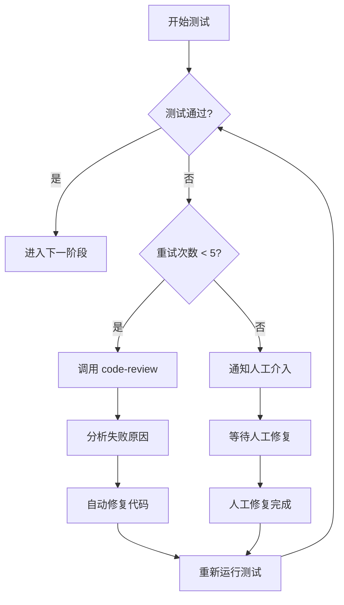
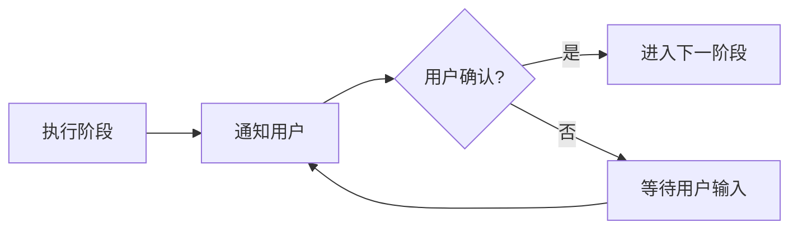
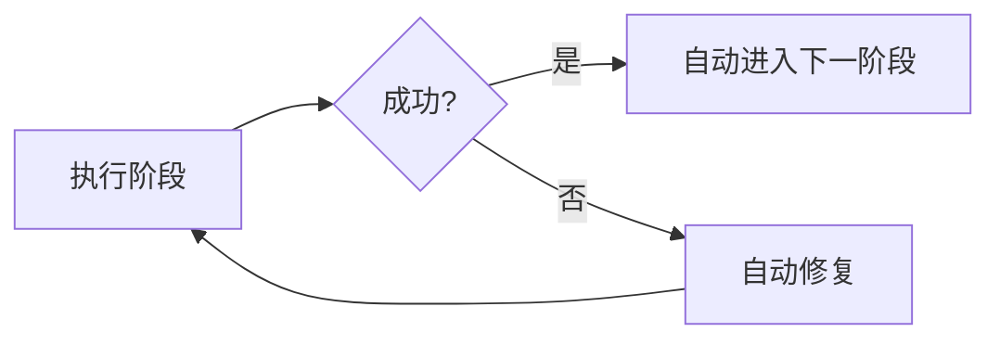

# 工作流状态机设计文档

## 概述

本文档详细描述工作流系统的状态机设计，包括状态定义、转换规则、钩子机制和执行流程。

---

## 状态机架构图

```
┌─────────┐     prd_valid      ┌─────────┐   design_valid   ┌─────────┐
│   PRD   │ ─────────────────> │   UI    │ ───────────────> │  Tech   │
└─────────┘                   │ Design  │                  │ Design  │
      │                        └─────────┘                  └─────────┘
      │                              │                            │
      │                              │                            │
      ▼                              ▼                            ▼
┌─────────┐                   ┌─────────┐                  ┌─────────┐
│  Tasks  │ ──── tasks_valid ──> │Execute │ ─── code_valid ──> │UnitTest │
└─────────┘                   └─────────┘                  └─────────┘
                                                                  │
                    ┌─────────────────────────────────────────────┘
                    │
                    ▼
            ┌───────────────┐
            │   单元测试     │
            │               │
            │  ┌─────────┐  │
            │  │测试通过? │  │
            │  └────┬────┘  │
            │       │       │
            │  通过  │  失败 │
            │       ▼       ▼
            │   [E2E]   [Bug修复]
            │   测试    ─────────┐
            │       │           │
            │       ▼           ▼
            │   ┌─────────┐ 重新测试
            │   │E2E通过? │
            │   └────┬────┘
            │        │
            │   通过 │ 失败
            │        ▼
            │   [Deploy]  [Bug修复]
            │      │          │
            │      ▼          ▼
            │   [完成]    重新测试
            └───────────────┘
```

### 状态说明

| 状态 | 说明 | 循环次数 |
|------|------|----------|
| PRD | 产品需求文档 | - |
| UI Design | UI/UX 设计规范 | - |
| Tech Design | 技术设计文档 | - |
| Tasks | 任务拆解 | - |
| Execute | 代码实现 | - |
| UnitTest | 单元测试 | 最多5次 |
| E2E Test | 端到端测试 | 最多5次 |
| Bug Fix | Bug 修复 | 由失败触发 |
| Deploy | 部署上线 | - |

---

## 状态定义

| 状态ID | 状态名称 | 说明 | 重试次数 |
|--------|----------|------|----------|
| prd | 产品需求 | 生成 PRD 文档 | - |
| ui-design | UI设计 | 生成 UI 设计规范 | - |
| tech | 技术设计 | 生成技术设计文档 | - |
| tasks | 任务拆解 | 生成任务列表 | - |
| execution | 代码实现 | 执行代码任务 | - |
| unit-test | 单元测试 | 执行单元测试用例 | 最多5次 |
| bug-fix | Bug修复 | 自动分析并修复测试失败 | - |
| e2e-test | E2E测试 | 执行端到端测试 | 最多5次 |
| deploy | 部署上线 | 推送到 GitHub | - |
| rollback | 回滚 | 失败时回滚操作 | - |

---

## 状态转换规则

### 转换矩阵

| 来源状态 | 目标状态 | 触发条件 | 说明 |
|----------|----------|----------|------|
| prd | ui-design | prd_valid | PRD 文档生成完成 |
| ui-design | tech | design_valid | UI 设计规范生成完成 |
| tech | tasks | tech_valid | 技术设计文档生成完成 |
| tasks | execution | tasks_valid | 任务列表生成完成 |
| execution | unit-test | code_valid | 代码实现完成 |
| unit-test | e2e-test | unit_pass | 单元测试全部通过 |
| unit-test | bug-fix | unit_fail | 单元测试失败 |
| bug-fix | unit-test | fix_applied | Bug 修复完成 |
| e2e-test | deploy | e2e_pass | E2E 测试全部通过 |
| e2e-test | bug-fix | e2e_fail | E2E 测试失败 |
| bug-fix | e2e-test | fix_applied | Bug 修复完成 |
| * | rollback | any_failed | 任意阶段失败 |

---

## 测试-修复循环机制

### 流程图



### 循环配置

```json
{
  "max_retry_count": 5,
  "retry_delay_seconds": 5,
  "test_pass_threshold": 100
}
```

| 参数 | 值 | 说明 |
|------|-----|------|
| max_retry_count | 5 | 最大自动重试次数 |
| retry_delay_seconds | 5 | 重试间隔（秒） |
| test_pass_threshold | 100 | 测试通过阈值（%） |

---

## 钩子事件列表

### 成功事件

| 事件名 | 触发时机 | 下一个 Skill |
|--------|----------|--------------|
| after_prd_created | PRD 文档生成完成 | ui-designer |
| after_ui_design | UI 设计完成 | tech-designer |
| after_tech_design | 技术设计完成 | task-planner |
| after_tasks_created | 任务拆解完成 | task-executor |
| after_task_execution | 代码实现完成 | unit-tester |
| after_unit_test_pass | 单元测试通过 | e2e-runner |
| after_e2e_test_pass | E2E 测试通过 | github-deploy |
| after_deploy | 部署完成 | - |

### 失败事件

| 事件名 | 触发时机 | 下一个 Skill |
|--------|----------|--------------|
| after_unit_test_fail | 单元测试失败 | code-review |
| after_e2e_test_fail | E2E 测试失败 | code-review |
| after_unit_test_max_retry | 单元测试达到最大重试 | 人工介入 |
| after_e2e_test_max_retry | E2E 测试达到最大重试 | 人工介入 |
| on_workflow_error | 工作流执行错误 | - |

### Bug 修复事件

| 事件名 | 触发时机 | 下一个 Skill |
|--------|----------|--------------|
| after_bug_fix | Bug 修复完成 | unit-tester / e2e-runner |

---

## 执行模式

### 交互式模式



### 自动模式



---

## 状态机配置示例

```json
{
  "version": "2.0",
  "modes": {
    "interactive": {
      "name": "交互式模式",
      "require_confirmation": true,
      "auto_proceed": false
    },
    "auto": {
      "name": "自动模式",
      "require_confirmation": false,
      "auto_proceed": true
    }
  },
  "config": {
    "max_retry_count": 5,
    "retry_delay_seconds": 5,
    "test_pass_threshold": 100
  }
}
```

---

## 版本历史

| 版本 | 日期 | 更新内容 |
|------|------|----------|
| 1.0 | 2026-06-10 | 初始版本，基础状态机 |
| 2.0 | 2026-06-11 | 新增测试-修复-重新测试循环机制 |

---

## 相关文件

- 状态机配置：`.trae/hooks/workflow.json`
- 工作流指南：`docs/workflow-guide.md`
- 全局技术规范：`docs/specs/全局技术规范.md`
